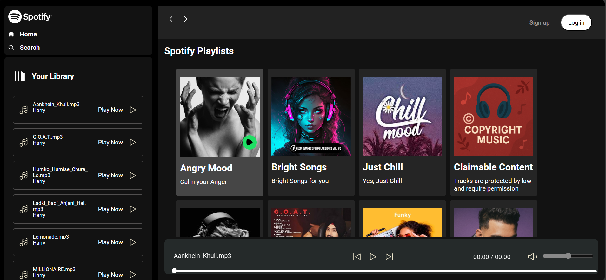

# 🎵 Spotify Clone 🎧

A fully functional and responsive **Spotify clone** built using **HTML**, **CSS**, and **JavaScript**. This project allows users to **play music**, control playback, view song lists with thumbnails, and enjoy a Spotify-like interface — all in the browser!

---

## 🚀 Features

- ✅ Play and pause songs
- ⏭️ Skip to next/previous track
- 📃 Playlist with custom songs
- 🖼️ Cover image per song
- ⏱️ Progress bar that updates with playback
- 📱 Responsive layout (mobile + desktop)

---

## 🛠️ Tech Stack

- **HTML5** – Markup structure
- **CSS3** – Styling & layout (Flexbox)
- **JavaScript (Vanilla JS)** – Music control, DOM manipulation
- **Audio Files** – `.mp3` songs

---

## 📂 Folder Structure

spotify-clone/
├── index.html # Main HTML file
├── style.css # Stylesheet
├── script.js # JavaScript functionality
├── songs/ # Folder containing MP3 audio files
│ ├── song1.mp3
│ ├── song2.mp3
│ └── ...
├── images/ # Album covers or song thumbnails
│ ├── cover1.jpg
│ └── ...
├── screenshot.png # Project preview image
└── README.md # This file

---

## 📷 Screenshot



---

## 🔧 How to Run the Project

1. **Clone the Repository**
   ```bash
   git clone https://github.com/PulkitGarg20/spotify-clone.git
